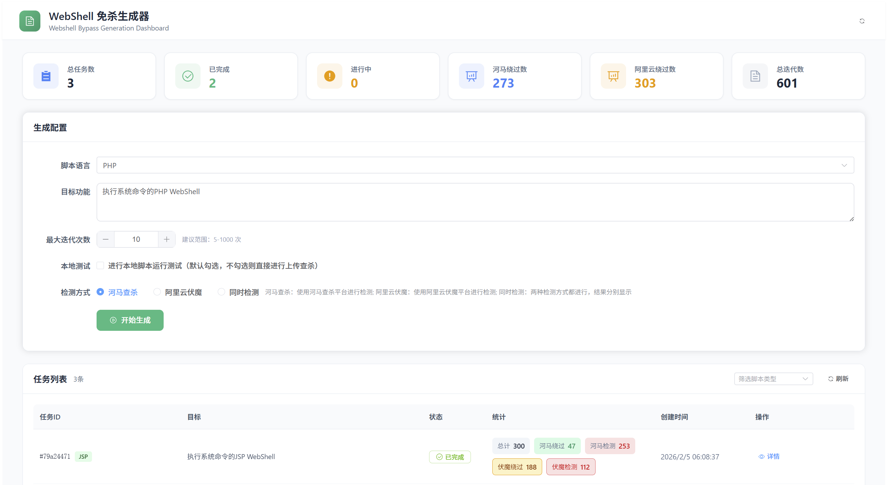
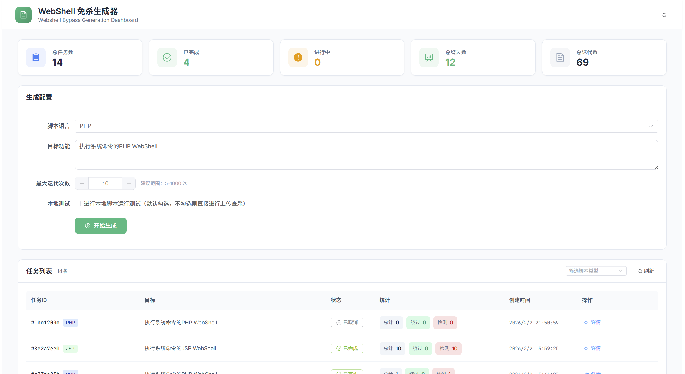
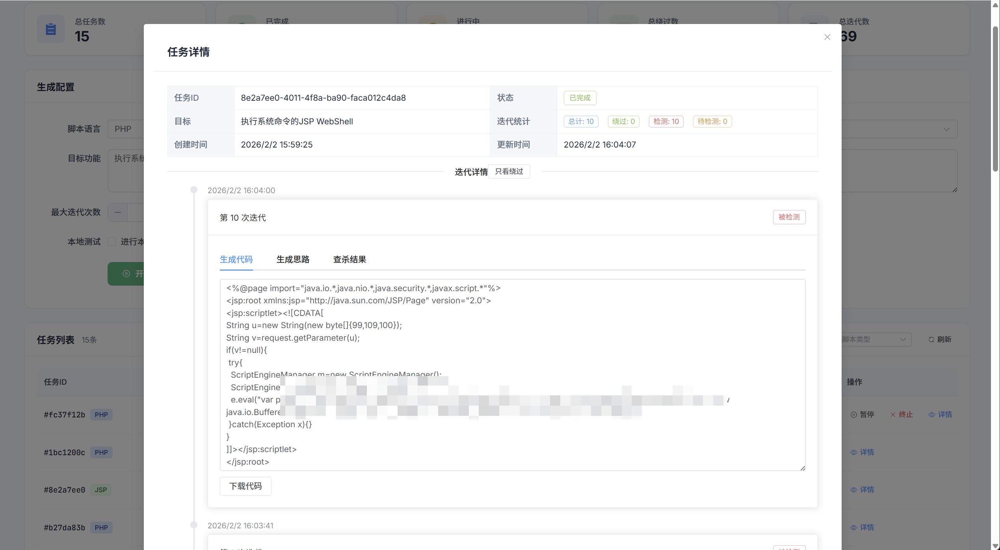
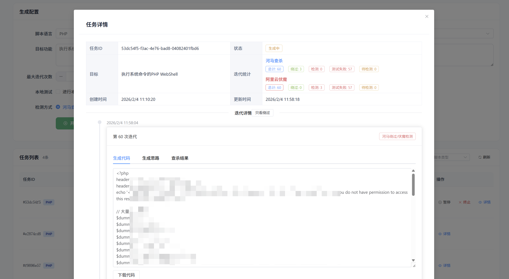
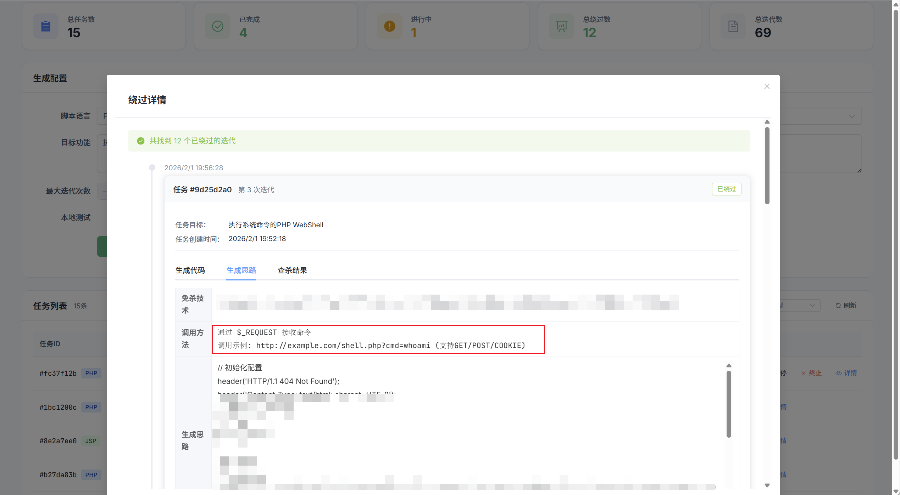
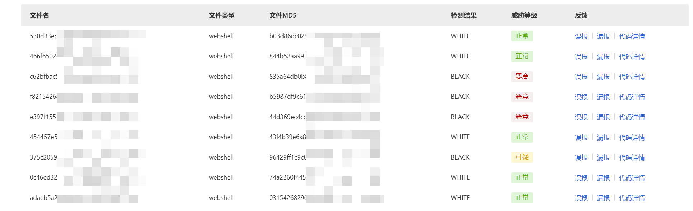
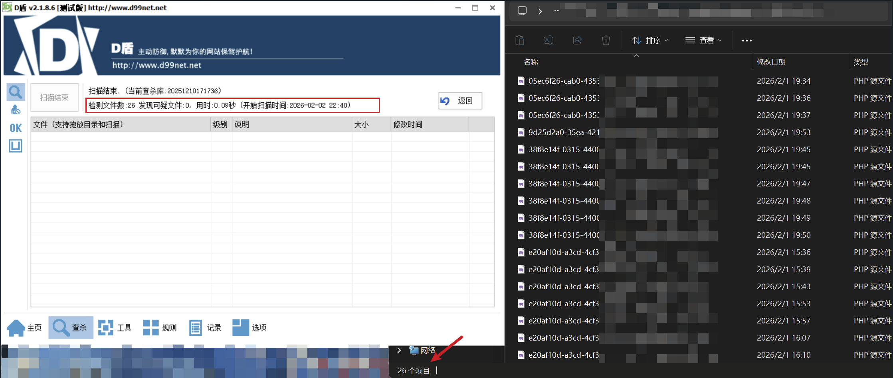
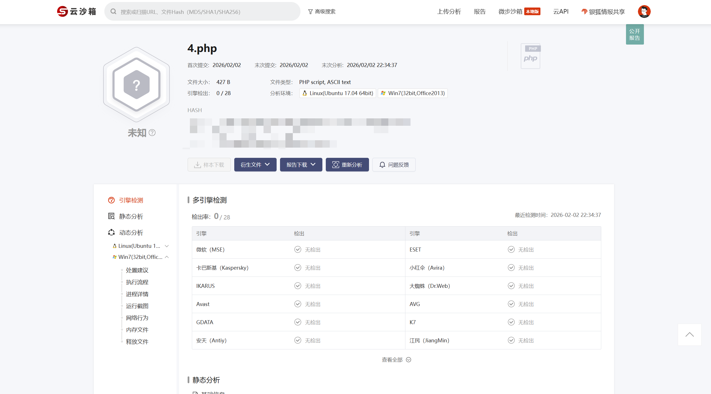

# WebShell Agent

一款基于 AI 大模型的 WebShell 自动生成工具，支持自动迭代优化，集成河马查杀和阿里云伏魔平台检测。

## 统计信息

主界面顶部显示系统的统计信息：

- **总任务数**：系统中所有任务的总数
- **已完成**：已完成的任务数量
- **进行中**：正在执行的任务数量
- **河马绕过数**：所有任务中成功绕过河马查杀的总次数
- **阿里云绕过数**：所有任务中成功绕过阿里云伏魔的总次数
- **总迭代数**：所有任务的迭代总次数

ps:这里为什么伏魔过这么多呢，原因如下：
当前提示词迭代采用逻辑，如果有绕过的思路，就是沿用绕过的思路，这也就导致看见绕过挺多，实际上均为1种思路

## 主要功能

- 🤖 AI 自动生成 WebShell 代码
- 🔄 智能迭代优化，直到绕过检测引擎
- 🛡️ 集成河马查杀和阿里云伏魔平台检测
- 🌐 支持 PHP、ASP、JSP、ASPX 等多种脚本语言
- 🐳 支持 Docker 自动部署测试环境
- 📊 任务管理：创建、暂停、恢复、取消
- 🔐 双重认证保护系统安全
- 💾 自动保存任务数据

## 使用说明

### 1. 登录系统

启动服务后，访问 `http://localhost:8080`，使用配置的用户名和密码登录。

### 2. 创建生成任务

登录后进入主界面，点击"开始生成"按钮创建新的 WebShell 生成任务。

在生成配置中填写以下信息：

- **脚本语言**：选择要生成的脚本语言（PHP、ASP、JSP、ASPX）
- **目标功能**：描述需要实现的功能，例如"执行系统命令的PHP WebShell"
- **最大迭代次数**：设置最大尝试次数（建议范围：5-1000次）
- **本地测试**：是否在生成后自动进行本地脚本运行测试
- **检测方式**：
  - **河马查杀**：使用河马查杀平台进行检测
  - **阿里云伏魔**：使用阿里云伏魔平台进行检测
  - **同时检测**：两种检测方式都进行，结果分别显示

### 3. 查看任务列表

主界面下方显示所有任务的列表，包括：

- **任务ID**：任务的唯一标识
- **目标**：任务的目标功能描述
- **状态**：任务当前状态（待处理、生成中、已完成、已失败等）
- **统计**：显示任务的统计信息
  - 总计迭代次数
  - 河马绕过/检测次数
  - 伏魔绕过/检测次数
- **创建时间**：任务创建的时间
- **操作**：可对任务进行暂停、终止、查看详情等操作

### 4. 查看任务详情

点击任务列表中的"详情"按钮，可以查看任务的详细迭代历史。

image-20260202222501721.png

每个迭代包含以下信息：

- **迭代编号**：迭代的序号
- **生成的代码**：AI 生成的 WebShell 代码
- **检测结果**：河马查杀或阿里云伏魔的检测结果
- **是否绕过**：是否成功绕过检测引擎
- **生成思路**：AI 生成代码的思路说明
- **调用方法**：如何使用生成的 WebShell
- **检测详情**：详细的检测信息

### 5. 查看绕过详情

在任务详情页面，可以查看所有成功绕过的迭代，方便快速找到可用的 WebShell。

### 6. 任务管理

在任务列表中，可以对任务进行以下操作：

- **暂停**：暂停正在运行的任务
- **恢复**：恢复已暂停的任务
- **终止**：终止任务执行
- **详情**：查看任务的详细信息和迭代历史

### 7. 查看生成的脚本

所有生成的脚本文件保存在 `scans/` 目录中，可以通过 Web 界面直接访问和下载。

测试成功的脚本会自动备份到 `test_success/` 目录。

### 8. 生成脚本查杀效果

## 注意事项

1. **合法使用**：本工具仅用于安全研究和授权测试，请勿用于非法用途
3. **测试环境**：建议在隔离的测试环境中使用，避免影响生产环境
4. **数据备份**：定期备份 `data/` 目录，防止数据丢失
5. **资源限制**：注意 LLM API 的调用频率限制，避免超出配额

## 免责声明

本工具仅用于安全研究和授权测试。使用者需自行承担使用本工具所产生的所有法律责任。
